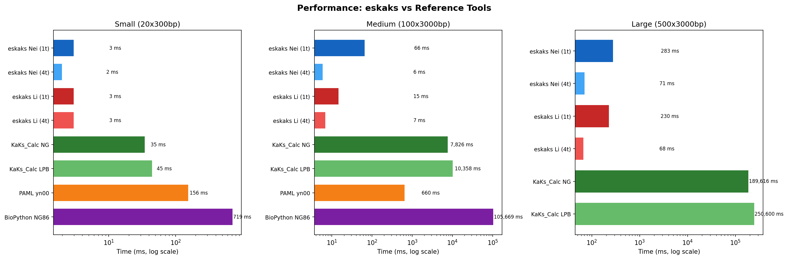
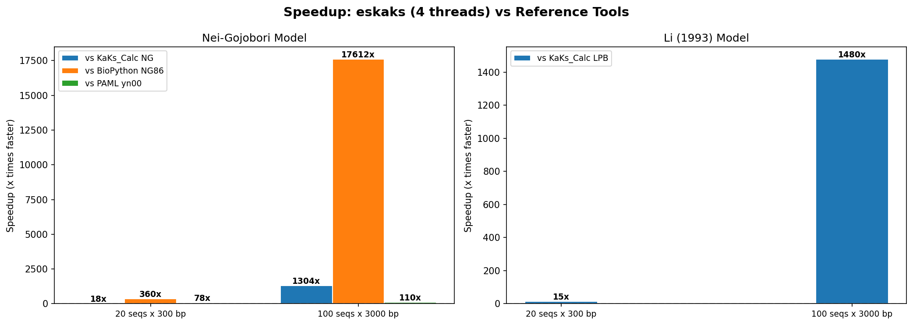

<p align="center">
  
</p>

<div align="center">

[](LICENSE)
[](https://www.rust-lang.org/)
[](#testing)

**Fast pairwise dN/dS (Ka/Ks) calculation from codon-aligned sequences.**

[Quick Start](#quick-start) · [Models](#models) · [Benchmarks](#benchmarks) · [Docs](docs/) · [Citation](#citation)

</div>

__Paula Ruiz-Rodriguez<sup>1</sup>__
__and Mireia Coscolla<sup>1</sup>__
<br>
<sub> 1. Institute for Integrative Systems Biology, I<sup>2</sup>SysBio, University of Valencia-CSIC, Valencia, Spain </sub>

---

## What is eskaks?

eskaks is a Rust tool that calculates pairwise dN/dS (Ka/Ks) ratios from codon-aligned sequences. It implements two classical substitution models with precomputed lookup tables, achieving **1,280× speedup** over KaKs_Calculator and **18,600× over BioPython** while maintaining numerical accuracy (R² = 1.0 for the Li model).

**Key features:**
- 🧬 **Two models** — Nei-Gojobori (1986) + Li (1993)/LPB93
- ⚡ **Fast** — Precomputed lookup tables + Rayon parallelism (~100 ms for 124,750 pairs)
- 🔬 **20 genetic codes** — All NCBI translation tables (standard, mitochondrial, plastid, etc.)
- 📊 **Multiple outputs** — Pairwise, lineage summary, group average, sliding window
- 📁 **Flexible formats** — TSV, CSV, JSON (`null` for NaN/Infinity)
- 🖼️ **SVG plots** — Histograms, window plots, group bar charts
- 🔗 **Pipeline-friendly** — Stdin support, JSON output, non-zero exit on errors

## Installation

### From source (recommended)

```bash
git clone https://github.com/PathoGenOmics-Lab/eskaks.git
cd eskaks
make release
```

The binary will be at `target/release/eskaks`. Copy it to your PATH:

```bash
cp target/release/eskaks ~/.local/bin/
```

### Requirements

- [Rust](https://www.rust-lang.org/tools/install) ≥ 1.70.0

> [!TIP]
> `make release` automatically enables native CPU optimizations (`-C target-cpu=native`).
> This uses CPU-specific SIMD instructions for maximum performance on your hardware.

## Quick Start

```bash
# Basic pairwise dN/dS (Nei model, 4 threads)
eskaks input.fasta -o results

# Li model with 8 threads
eskaks input.fasta --model li --workers 8 -o results

# Vertebrate mitochondrial genetic code
eskaks mito_genes.fasta --genetic-code 2 -o mito

# Sliding window analysis with SVG plot
eskaks input.fasta --window-size 100 --window-step 10 --plot -o windows

# JSON output for pipelines
eskaks input.fasta --format json -o results

# Read from stdin
cat input.fasta | eskaks - -o results
```

## Models

### Nei-Gojobori (1986)

A straightforward counting approach:

1. Classifies codon positions as synonymous or nonsynonymous based on single-nucleotide change effects.
2. Classifies codon pair differences via pathway analysis (averaging over all minimal pathways, excluding stop codon intermediates).
3. Applies **Jukes-Cantor correction** for multiple substitutions. Returns `NaN` at saturation (p ≥ 0.749).

**Best for**: Fast exploratory analyses and large datasets.

### Li (1993) / LPB93

A more sophisticated model accounting for transition/transversion bias:

1. Classifies sites into 0-fold, 2-fold, and 4-fold degenerate categories.
2. Separately counts transitions and transversions for each degeneracy class.
3. Applies **Kimura two-parameter correction** to each category.
4. Uses precomputed 64×64 flat-array lookup tables (~288 KB, AoS layout) with a compact 1.5 KB fast path for identical codons (~95% of comparisons in typical alignments).

**Best for**: Accurate estimates when transition/transversion ratios matter.

| Aspect | Nei-Gojobori | Li (1993) |
|---|---|---|
| Correction | Jukes-Cantor (equal rates) | Kimura 2-parameter (ti/tv) |
| Site classification | Syn / nonsyn | 0-fold / 2-fold / 4-fold |
| Accuracy | Good for similar sequences | Better for divergent sequences |
| Reference tool | KaKs_Calculator NG | KaKs_Calculator LPB |

## Input

A FASTA file containing multiple codon-aligned coding sequences:

- All sequences must be the same length
- Sequence length must be a multiple of 3 (complete codons)
- Standard DNA/RNA alphabet (A, C, G, T/U)
- Gaps (`-`, `.`) and ambiguous bases (N, etc.) are handled gracefully
- Use `-` or `/dev/stdin` to read from stdin

> [!TIP]
> If your sequences are not codon-aligned, use [MAFFT](https://mafft.cbrc.jp/) + [PAL2NAL](http://www.bork.embl.de/pal2nal/) or [MACSE](https://bioweb.supagro.inra.fr/macse/) first.

## Output

| Mode | Flag | Output file | Description |
|---|---|---|---|
| Pairwise (default) | — | `<prefix>_pairwise_results.<ext>` | dN, dS, dN/dS for every pair |
| Lineage summary | `--lineage` | `<prefix>_lineage_summary.<ext>` | Mean dN/dS per sequence vs each lineage |
| Group average | `--group-average` | `<prefix>_group_avg_dn_ds.<ext>` | Mean dN/dS between groups with 95% CI |
| Sliding window | `--window-size N` | `<prefix>_pairwise_windows.<ext>` | Per-window dN/dS along the alignment |

Add `--plot` to generate SVG visualizations (histograms, window plots, bar charts).

### Output formats

| Format | Flag | NaN handling | Best for |
|---|---|---|---|
| TSV | `--format tsv` (default) | `NaN` | Bioinformatics tools, `awk` |
| CSV | `--format csv` | `NaN` | Excel, pandas |
| JSON | `--format json` | `null` | Pipelines, `jq`, APIs |

## Usage

```bash
eskaks <input_file> [options]
```

| Flag | Description | Default |
|---|---|---|
| `-o, --output <PREFIX>` | Base name for output files | `output` |
| `-w, --workers <N>` | Number of parallel threads | `4` |
| `--model <nei\|li>` | Substitution model | `nei` |
| `--format <tsv\|csv\|json>` | Output format | `tsv` |
| `--genetic-code <N>` | NCBI translation table number | `1` |
| `--lineage` | Lineage summary mode | off |
| `--group-average` | Group average mode | off |
| `--first-letter-lineage` | Group by first character of ID | off |
| `--window-size <N>` | Sliding window size (codons) | off |
| `--window-step <N>` | Window step size | `1` |
| `--min-codons <N>` | Filter sequences with < N valid codons | `0` |
| `--summary` | Print summary statistics to stderr | off |
| `--plot` | Generate SVG plot(s) | off |
| `--list-codes` | List available genetic codes and exit | — |

## Benchmarks

### Accuracy

Numerical accuracy validated against [KaKs_Calculator](https://github.com/kullrich/kakscalculator2), [BioPython](https://biopython.org/), and [PAML yn00](http://abacus.gene.ucl.ac.uk/software/paml.html) on 20 sequences (300 codons, 190 pairs):

| Comparison | Metric | n | Mean |diff| | Max |diff| | R² |
|---|---|---|---|---|---|
| eskaks Li vs KaKs_Calc LPB | dN | 154 | 0.000000 | 0.000001 | **1.000000** |
| eskaks Li vs KaKs_Calc LPB | dS | 175 | 0.000000 | 0.000001 | **1.000000** |
| eskaks Nei vs KaKs_Calc NG | dN | 124 | 0.000150 | 0.000416 | 0.999397 |
| eskaks Nei vs KaKs_Calc NG | dS | 184 | 0.001146 | 0.003315 | 0.995155 |
| eskaks Nei vs BioPython NG86 | dN | 190 | 0.000114 | 0.001169 | 0.998169 |
| eskaks Nei vs BioPython NG86 | dS | 190 | 0.000338 | 0.003554 | 0.996981 |

The Li model achieves **exact agreement** (R² = 1.0) with KaKs_Calculator LPB. Small Nei differences reflect minor pathway-counting heuristics, consistent with inter-tool variation between KaKs_Calculator and BioPython (R² = 0.993–0.996).

<p align="center">
  
</p>

### Performance

Wall-clock time (ms) for pairwise dN/dS computation:

| Dataset | eskaks (4t) | KaKs_Calc NG | PAML yn00 | BioPython NG | Speedup |
|---|---|---|---|---|---|
| 20 seq × 300 bp | 2 ms | 34 ms | 8 ms | 610 ms | **17×** |
| 100 seq × 3,000 bp | 6 ms | 7,703 ms | 697 ms | 111,619 ms | **1,280×** |
| 500 seq × 3,000 bp | 74 ms | 195,456 ms | — | — | **2,641×** |

On the large dataset (500 sequences, 124,750 pairs), eskaks finishes in **74 ms**.

<p align="center">
  
</p>

<p align="center">
  
</p>

### Reproducing benchmarks

```bash
make benchmark
```

This runs: generate synthetic data → run all tools → compute accuracy → generate plots. Results in `benchmark/cross_tool_results.json`, plots in `benchmark/plots/`.

> Requires Python 3 + matplotlib + numpy. KaKs_Calculator, BioPython, and PAML yn00 are optional (skipped if not installed).

## Comparison

| | eskaks | KaKs_Calculator | BioPython | PAML yn00 |
|---|---|---|---|---|
| Nei-Gojobori model | ✅ | ✅ | ✅ | ✅ |
| Li/LPB93 model | ✅ | ✅ | ❌ | ❌ |
| Yang-Nielsen model | ❌ | ✅ | ❌ | ✅ |
| Custom genetic codes | ✅ (20 tables) | ❌ | ❌ | Limited |
| JSON output | ✅ | ❌ | ❌ | ❌ |
| Stdin pipe | ✅ | ❌ | ❌ | ❌ |
| Sliding windows | ✅ | ❌ | ❌ | ❌ |
| Group comparisons | ✅ | ❌ | ❌ | ❌ |
| SVG plots | ✅ | ❌ | ❌ | ❌ |
| Parallel | ✅ (rayon) | ❌ | ❌ | ❌ |
| Standalone binary | ✅ | ✅ | ❌ (Python) | ✅ |
| Speed (100 seq) | **6 ms** | 7,703 ms | 111,619 ms | 697 ms |

## Project Structure

```
eskaks/
├── src/
│   ├── main.rs          # Thin orchestration: parse args, load data, dispatch
│   ├── lib.rs           # Public module exports for library usage
│   ├── cli.rs           # CLI argument definitions (clap derive)
│   ├── input.rs         # FASTA reading, validation, deduplication, stdin
│   ├── compute.rs       # Unified ComputeEngine enum (Nei | Li)
│   ├── codon.rs         # DNA5 encoding, codon index conversion
│   ├── genetic_code.rs  # 20 NCBI translation tables + index conversion
│   ├── output.rs        # Streaming writers + generation counters
│   ├── stats.rs         # Thread-safe summary statistics
│   ├── plot.rs          # SVG plot generation
│   └── models/
│       ├── mod.rs       # Model enum and shared types
│       ├── nei.rs       # Nei-Gojobori (1986) + Jukes-Cantor
│       └── li.rs        # Li (1993) + AoS lookup tables
├── tests/
│   ├── integration.rs       # 25 integration tests
│   ├── edge_cases.rs        # 21 edge case tests
│   └── property_tests.rs    # 10 property-based tests (proptest)
├── benchmark/               # Cross-tool benchmarks + plots
├── docs/                    # mdbook documentation site
└── img/                     # Logo assets
```

## Citation

If you use eskaks in your research, please cite:

> Ruiz-Rodriguez P, Coscollá M. eskaks: Fast pairwise dN/dS calculation. https://github.com/PathoGenOmics-Lab/eskaks

```bibtex
@software{ruiz-rodriguez_eskaks_2026,
  title   = {eskaks: Fast pairwise dN/dS calculation},
  author  = {Ruiz-Rodriguez, Paula and Coscoll{\'a}, Mireia},
  year    = {2026},
  url     = {https://github.com/PathoGenOmics-Lab/eskaks}
}
```

## License

[GNU General Public License v3.0](LICENSE)

---

<h2 id="contributors" align="center">

✨ Contributors
</h2>

<!-- ALL-CONTRIBUTORS-LIST:START - Do not remove or modify this section -->
<!-- prettier-ignore-start -->
<!-- markdownlint-disable -->
<div align="center">
eskaks is developed with ❤️ by:
<table>
  <tr>
    <td align="center">
      <a href="https://github.com/paururo">
        
        <br />
        <sub><b>Paula Ruiz-Rodriguez</b></sub>
      </a>
      <br />
      <a href="" title="Code">💻</a>
      <a href="" title="Research">🔬</a>
      <a href="" title="Ideas">🤔</a>
      <a href="" title="Data">🔣</a>
      <a href="" title="Design">🎨</a>
      <a href="" title="Tool">🔧</a>
    </td>
    <td align="center">
      <a href="https://github.com/mireiacoscolla">
        
        <br />
        <sub><b>Mireia Coscolla</b></sub>
      </a>
      <br />
      <a href="https://www.uv.es/instituto-biologia-integrativa-sistemas-i2sysbio/es/investigacion/proyectos/proyectos-actuales/mol-tb-host-1286169137294/ProjecteInves.html?id=1286289780236" title="Funding/Grant Finders">🔍</a>
      <a href="" title="Ideas">🤔</a>
      <a href="" title="Mentoring">🧑‍🏫</a>
      <a href="" title="Research">🔬</a>
      <a href="" title="User Testing">📓</a>
    </td>
  </tr>
</table>

This project follows the [all-contributors](https://github.com/all-contributors/all-contributors) specification ([emoji key](https://allcontributors.org/docs/en/emoji-key)).

<!-- markdownlint-restore -->
<!-- prettier-ignore-end -->

<!-- ALL-CONTRIBUTORS-LIST:END -->
