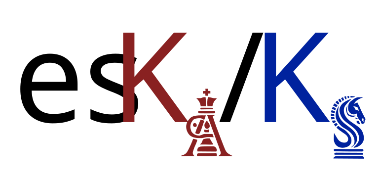

<p align="center">
  
</p>

<div align="center">

[](LICENSE)
[](https://www.rust-lang.org/)
[](#project-structure)

**Fast pairwise dN/dS (Ka/Ks) and per-gene pN/pS from codon-aligned sequences or VCF files.**

[Quick Start](#quick-start) · [Usage](#usage) · [Benchmarks](benchmarks/) · [Docs](docs/) · [Citation](#citation)

</div>

__Paula Ruiz-Rodriguez<sup>1</sup>__
__and Mireia Coscolla<sup>1</sup>__
<br>
<sub> 1. Institute for Integrative Systems Biology, I<sup>2</sup>SysBio, University of Valencia-CSIC, Valencia, Spain </sub>

---

## What is eskaks?

eskaks is a Rust tool for evolutionary rate analysis. It computes **pairwise dN/dS** from codon-aligned sequences and **per-gene pN/pS** from VCF files. It implements two classical substitution models with precomputed lookup tables, achieving **1,280× speedup** over KaKs_Calculator while maintaining numerical accuracy (R² = 1.0 for the Li model).

**Two modes:**

| Mode | Command | Input | Output |
|---|---|---|---|
| **dN/dS** | `eskaks fasta` | Codon-aligned FASTA | Pairwise dN, dS, dN/dS |
| **pN/pS** | `eskaks vcf` | VCF + reference + GFF3 | Per-gene + genome-wide pN, pS, pN/pS |

**Key features:**
- 🧬 **Two models** — [Nei-Gojobori (1986) + Li (1993)/LPB93](docs/models.md)
- ⚡ **Fast** — Precomputed lookup tables + Rayon parallelism (~100 ms for 124,750 pairs)
- 🔬 **[20 genetic codes](docs/genetic-codes.md)** — All NCBI translation tables (standard, mitochondrial, plastid, etc.)
- 🧪 **[VCF analysis](docs/vcf-analysis.md)** — pN/pS per gene (plus a pooled genome-wide estimate) from population variants (VCF + GFF3)
- 📊 **Multiple outputs** — Pairwise, lineage summary, group average, sliding window, per-gene
- 📁 **[Flexible formats](docs/output-formats.md)** — TSV, CSV, JSON (`null` for NaN/Infinity)
- 🖼️ **SVG plots** — Histograms, window plots, group bar charts, Manhattan plots
- 🔗 **Pipeline-friendly** — Stdin support, JSON output, non-zero exit on errors

## Installation

```bash
git clone https://github.com/PathoGenOmics-Lab/eskaks.git
cd eskaks
make release
cp target/release/eskaks ~/.local/bin/
```

Requires [Rust](https://www.rust-lang.org/tools/install) ≥ 1.70.0. `make release` enables native CPU optimizations automatically.

## Quick Start

### Pairwise dN/dS (FASTA)

```bash
# Basic pairwise dN/dS (Nei model, 4 threads)
eskaks fasta input.fasta -o results

# Li model with 8 threads
eskaks fasta input.fasta --model li --workers 8 -o results

# Vertebrate mitochondrial genetic code
eskaks fasta mito_genes.fasta --genetic-code 2 -o mito

# Sliding window with SVG plot
eskaks fasta input.fasta --window-size 100 --window-step 10 --plot -o windows

# From stdin
cat input.fasta | eskaks fasta - -o results
```

### pN/pS per gene (VCF)

```bash
# One VCF per sample, AF-weighted (πN/πS)
eskaks vcf --ref H37Rv.fasta --gff H37Rv.gff3 \
  --vcf sample1.vcf --vcf sample2.vcf --vcf sample3.vcf \
  --af-weighted --genetic-code 11 -o population_pnps

# Or use a file listing VCF paths
eskaks vcf --ref H37Rv.fasta --gff H37Rv.gff3 \
  --vcf-list samples.txt --af-weighted --plot -o population_pnps

# Single multi-sample VCF also works
eskaks vcf --ref ref.fasta --gff ref.gff3 --vcf population.vcf -o results
```

Alongside the per-gene table, the run prints a **genome-wide (pooled) pN/pS** to
stderr — counts and sites summed across all genes — as an overall signal of
selection. See [docs/vcf-analysis.md](docs/vcf-analysis.md#genome-wide-pooled-pnps).

> [!TIP]
> If your sequences are not codon-aligned, use [MAFFT](https://mafft.cbrc.jp/) + [PAL2NAL](http://www.bork.embl.de/pal2nal/) or [MACSE](https://bioweb.supagro.inra.fr/macse/) first.

## Usage

```bash
eskaks fasta <input_file> [options]           # pairwise dN/dS
eskaks vcf --ref --gff --vcf ... [options]    # per-gene pN/pS (one VCF per sample)
eskaks --list-codes                           # show genetic code tables
```

See [docs/cli-reference.md](docs/cli-reference.md) for all flags and examples.

## Performance

<p align="center">
  
</p>

| Dataset | eskaks (4t) | KaKs_Calculator | PAML yn00 | BioPython | Speedup |
|---|---|---|---|---|---|
| 20 seq × 300 bp | 2 ms | 34 ms | 8 ms | 610 ms | 17× |
| 100 seq × 3 kb | 6 ms | 7,703 ms | 697 ms | 111,619 ms | **1,280×** |
| 500 seq × 3 kb | 74 ms | 195,456 ms | — | — | **2,641×** |

Li model achieves **R² = 1.0** vs KaKs_Calculator LPB. Full accuracy data and methodology in [benchmarks/](benchmarks/).

## Comparison

| | eskaks | KaKs_Calculator | BioPython | PAML yn00 |
|---|---|---|---|---|
| Nei-Gojobori model | ✅ | ✅ | ✅ | ✅ |
| Li/LPB93 model | ✅ | ✅ | ❌ | ❌ |
| Custom genetic codes | ✅ (20 tables) | ❌ | ❌ | Limited |
| JSON output | ✅ | ❌ | ❌ | ❌ |
| Stdin pipe | ✅ | ❌ | ❌ | ❌ |
| Sliding windows | ✅ | ❌ | ❌ | ❌ |
| Group comparisons | ✅ | ❌ | ❌ | ❌ |
| SVG plots | ✅ | ❌ | ❌ | ❌ |
| Parallel | ✅ | ❌ | ❌ | ❌ |
| Speed (100 seq) | **6 ms** | 7,703 ms | 111,619 ms | 697 ms |

## Documentation

| Document | Topic |
|---|---|
| [Models](docs/models.md) | Nei-Gojobori vs Li, when to use each |
| [Genetic Codes](docs/genetic-codes.md) | 20 NCBI translation tables |
| [Output Formats](docs/output-formats.md) | TSV, CSV, JSON — modes and SVG plots |
| [VCF Analysis (pN/pS)](docs/vcf-analysis.md) | VCF + reference + GFF3 → pN/pS per gene |
| [Interpreting Results](docs/interpreting-results.md) | dN/dS ratios, selection, caveats |
| [CLI Reference](docs/cli-reference.md) | All flags, examples, exit codes |
| [FAQ](docs/faq.md) | Speed, NaN, stop codons, library usage |
| [Benchmarks](benchmarks/) | Accuracy, performance, reproducing |

## Project Structure

```
eskaks/
├── src/
│   ├── main.rs           # Orchestration + subcommand dispatch
│   ├── cli.rs            # CLI definitions (clap subcommands)
│   ├── input.rs          # FASTA reading, validation, stdin
│   ├── compute.rs        # ComputeEngine enum (Nei | Li)
│   ├── codon.rs          # DNA5 encoding
│   ├── genetic_code.rs   # 20 NCBI tables
│   ├── output.rs         # Streaming writers
│   ├── stats.rs          # Summary statistics
│   ├── plot.rs           # SVG generation
│   ├── vcf.rs            # VCF parser (SNPs, AF, multi-allelic)
│   ├── gff.rs            # GFF3 parser (CDS, multi-exon, strand)
│   ├── vcf_analysis.rs   # pN/pS computation + output + plot
│   └── models/           # nei.rs, li.rs
├── tests/                # 192 tests (integration + edge + property + vcf)
├── benchmarks/           # Cross-tool accuracy & performance
├── docs/                 # Detailed documentation
└── img/                  # Logo assets
```

## Citation

If you use eskaks in your research, please cite:

> Ruiz-Rodriguez P, Coscollá M. eskaks: Fast pairwise dN/dS calculation. https://github.com/PathoGenOmics-Lab/eskaks

```bibtex
@software{ruiz-rodriguez_eskaks_2026,
  title   = {eskaks: Fast pairwise dN/dS calculation},
  author  = {Ruiz-Rodriguez, Paula and Coscoll{\'a}, Mireia},
  year    = {2026},
  url     = {https://github.com/PathoGenOmics-Lab/eskaks}
}
```

## License

[GNU General Public License v3.0](LICENSE)

---

<h2 id="contributors" align="center">

✨ Contributors
</h2>

<!-- ALL-CONTRIBUTORS-LIST:START - Do not remove or modify this section -->
<!-- prettier-ignore-start -->
<!-- markdownlint-disable -->
<div align="center">
eskaks is developed with ❤️ by:
<table>
  <tr>
    <td align="center">
      <a href="https://github.com/paururo">
        
        <br />
        <sub><b>Paula Ruiz-Rodriguez</b></sub>
      </a>
      <br />
      <a href="" title="Code">💻</a>
      <a href="" title="Research">🔬</a>
      <a href="" title="Ideas">🤔</a>
      <a href="" title="Data">🔣</a>
      <a href="" title="Design">🎨</a>
      <a href="" title="Tool">🔧</a>
    </td>
    <td align="center">
      <a href="https://github.com/mireiacoscolla">
        
        <br />
        <sub><b>Mireia Coscolla</b></sub>
      </a>
      <br />
      <a href="https://www.uv.es/instituto-biologia-integrativa-sistemas-i2sysbio/es/investigacion/proyectos/proyectos-actuales/mol-tb-host-1286169137294/ProjecteInves.html?id=1286289780236" title="Funding/Grant Finders">🔍</a>
      <a href="" title="Ideas">🤔</a>
      <a href="" title="Mentoring">🧑‍🏫</a>
      <a href="" title="Research">🔬</a>
      <a href="" title="User Testing">📓</a>
    </td>
  </tr>
</table>

This project follows the [all-contributors](https://github.com/all-contributors/all-contributors) specification ([emoji key](https://allcontributors.org/docs/en/emoji-key)).

<!-- markdownlint-restore -->
<!-- prettier-ignore-end -->

<!-- ALL-CONTRIBUTORS-LIST:END -->
