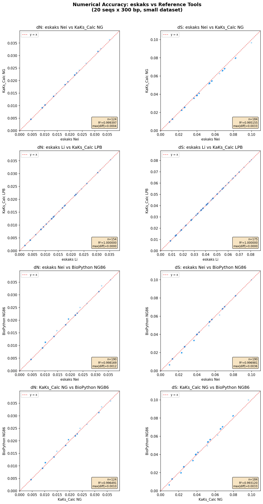
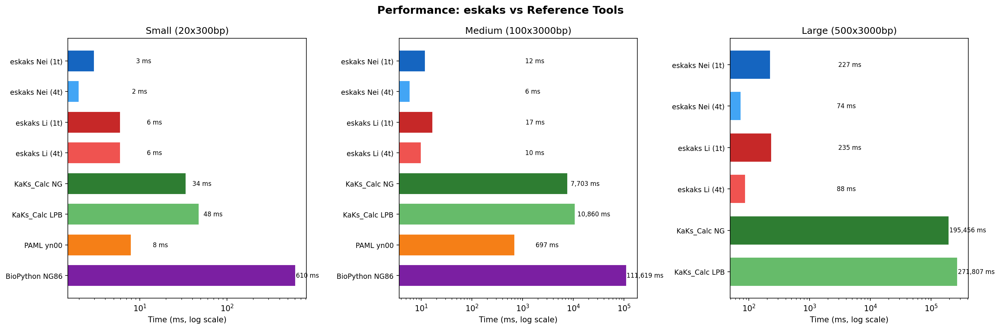
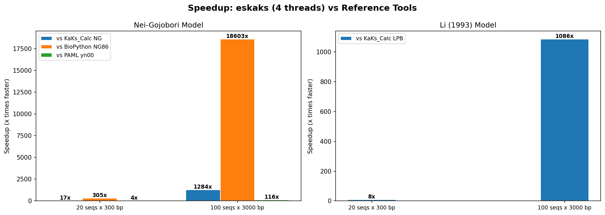

# Benchmarks

eskaks was benchmarked against three established dN/dS tools on synthetic datasets of varying sizes. All benchmarks were run on a single machine; eskaks timings include both single-threaded (1t) and multi-threaded (4t) runs.

## Accuracy

Numerical accuracy validated against [KaKs_Calculator](https://github.com/kullrich/kakscalculator2), [BioPython](https://biopython.org/), and [PAML yn00](http://abacus.gene.ucl.ac.uk/software/paml.html) on 20 sequences (300 bp, 190 pairs).

### Li model vs KaKs_Calculator LPB

| Metric | n | Mean abs diff | Max abs diff | R² |
|---|---|---|---|---|
| dN | 154 | 0.000000 | 0.000001 | **1.000000** |
| dS | 175 | 0.000000 | 0.000001 | **1.000000** |

### Nei model vs KaKs_Calculator NG

| Metric | n | Mean abs diff | Max abs diff | R² |
|---|---|---|---|---|
| dN | 124 | 0.000150 | 0.000416 | 0.999397 |
| dS | 184 | 0.001146 | 0.003315 | 0.995155 |

### Nei model vs BioPython NG86

| Metric | n | Mean abs diff | Max abs diff | R² |
|---|---|---|---|---|
| dN | 190 | 0.000114 | 0.001169 | 0.998169 |
| dS | 190 | 0.000338 | 0.003554 | 0.996981 |

The Li model achieves **exact agreement** (R² = 1.0) with KaKs_Calculator LPB. Small Nei differences reflect minor pathway-counting heuristics, consistent with the inter-tool variation observed between KaKs_Calculator and BioPython themselves (R² = 0.993–0.996).

<p align="center">
  
</p>

## Performance

Wall-clock time (ms) for pairwise dN/dS computation:

| Dataset | eskaks Nei (1t) | eskaks Nei (4t) | eskaks Li (1t) | eskaks Li (4t) | KaKs_Calc NG | KaKs_Calc LPB | yn00 | BioPython |
|---|---|---|---|---|---|---|---|---|
| 20 seq × 300 bp | 3 | 2 | 6 | 6 | 34 | 48 | 8 | 610 |
| 100 seq × 3 kb | 12 | 6 | 17 | 10 | 7,703 | 10,860 | 697 | 111,619 |
| 500 seq × 3 kb | 227 | 74 | 235 | 88 | 195,456 | 271,807 | — | — |

On the medium dataset (100 sequences, 3,000 bp), eskaks Nei (4t) is **1,280× faster** than KaKs_Calculator NG and **18,600× faster** than BioPython. On the large dataset (500 sequences, 124,750 pairs), eskaks finishes in under 100 ms.

<p align="center">
  
</p>

<p align="center">
  
</p>

## Reproducing

```bash
# Full pipeline: generate data → run all tools → accuracy → plots
make benchmark

# Or step by step:
make bench-generate    # Generate synthetic datasets
make bench-run         # Run cross-tool benchmarks
make bench-plot        # Generate accuracy/performance plots
```

### Requirements

- eskaks (`make release`)
- Python 3 + matplotlib + numpy

Optional (skipped if not installed):
- [KaKs_Calculator](https://github.com/kullrich/kakscalculator2)
- [BioPython](https://biopython.org/)
- [PAML yn00](http://abacus.gene.ucl.ac.uk/software/paml.html)

### Output

- `cross_tool_results.json` — All timings and accuracy metrics
- `plots/accuracy_scatter.png` — dN/dS correlation scatter plots
- `plots/performance_bars.png` — Wall-clock time bar chart
- `plots/speedup_chart.png` — Speedup multiplier chart
