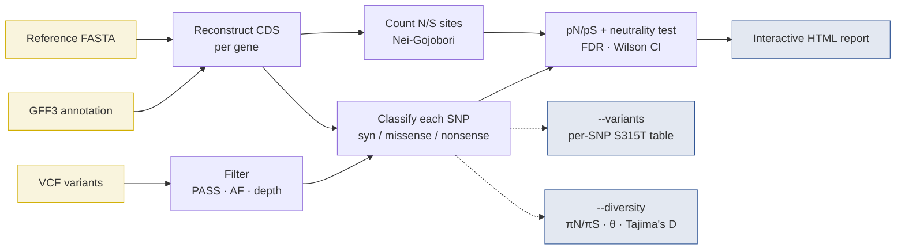

# VCF Analysis (pN/pS)

eskaks can compute **pN/pS per gene** directly from a VCF file, a reference genome, and a GFF3 annotation.

## What is pN/pS?

While dN/dS measures *fixed* substitutions between species, **pN/pS** measures the ratio of *polymorphic* nonsynonymous to synonymous variants within a population:

| Metric | What it measures | Input |
|---|---|---|
| dN/dS | Divergence (fixed substitutions) | Aligned sequences (FASTA) |
| pN/pS | Polymorphism (segregating variants) | VCF + reference + annotation |

| pN/pS | Interpretation |
|---|---|
| **< 1** | Purifying selection, most amino acid changes are removed |
| **≈ 1** | Neutral evolution or pseudogene |
| **> 1** | Possible positive/diversifying selection |

## Usage

### One VCF per sample (typical workflow)

```bash
# Provide each sample's VCF individually
eskaks vcf --ref H37Rv.fasta --gff H37Rv.gff3 \
  --vcf sample1.vcf --vcf sample2.vcf --vcf sample3.vcf \
  --af-weighted --genetic-code 11 -o population_pnps

# Or use a file with one VCF path per line
eskaks vcf --ref H37Rv.fasta --gff H37Rv.gff3 \
  --vcf-list samples.txt --af-weighted -o population_pnps
```

When multiple VCFs are provided, eskaks **merges** them and computes the allele frequency as the fraction of samples carrying each variant. For example, if 30 out of 100 samples have a SNP → AF = 0.3.

### Single multi-sample VCF

```bash
eskaks vcf --ref reference.fasta --gff annotation.gff3 --vcf population.vcf -o results
```

When a single VCF is provided, allele frequencies are taken from INFO/AF or calculated from GT fields.

### Required arguments

| Flag | Description |
|---|---|
| `--ref <FASTA>` | Reference genome in FASTA format |
| `--gff <GFF3>` | Gene annotation in GFF3 format (CDS features) |
| `--vcf <VCF>` | VCF file(s), use multiple times for per-sample VCFs |

### Options

| Flag | Description | Default |
|---|---|---|
| `--vcf-list <FILE>` | File with one VCF path per line (alternative to multiple `--vcf`) | none |
| `--af-weighted` | Weight SNP counts by allele frequency (πN/πS instead of pN/pS) | off |
| `-o, --output <PREFIX>` | Base name for output files | `output` |
| `--format <tsv\|csv\|json>` | Output format | `tsv` |
| `--genetic-code <N>` | NCBI translation table | `1` |
| `--pass-only` | Only include FILTER=PASS (or `.`) variants | off |
| `--min-af <FLOAT>` | Minimum allele frequency (0.0–1.0) | none |
| `--max-af <FLOAT>` | Maximum allele frequency, use 0.99 to exclude fixed variants | none |
| `--min-depth <INT>` | Minimum read depth (INFO/DP) | none |
| `--kappa <FLOAT>` | Transition/transversion rate ratio for [spectrum-aware site counting](#kappa) | `1.0` (equal rates) |
| `--min-snps <INT>` | Drop genes with fewer SNPs from the per-gene table, plot, and [test](#per-gene-neutrality-test) (the pooled estimate still uses all genes) | `0` |
| `--fdr <FLOAT>` | FDR threshold for calling genes significant in the [neutrality test](#per-gene-neutrality-test) | `0.05` |
| `--variants` | Write a [per-coding-SNP table](#per-variant-table-variants) (`<prefix>_variants.<ext>`) with position, `S315T`-style change, AF, and effect | off |
| `--diversity` | Write per-gene [πN/πS, Watterson θ, Tajima's D](#population-diversity-diversity) (`<prefix>_diversity.<ext>`); needs a sample size | off |
| `--codon-scan` | Write the [per-codon recurrence scan](#codon-scan) (`<prefix>_codons.<ext>`): codons ranked by how many *distinct* nonsynonymous alleles they carry | off |
| `--mk` | Also run a per-gene [McDonald-Kreitman test](#mcdonald-kreitman-test) (writes `<prefix>_mk.<ext>`) | off |
| `--mk-fixed-af <FLOAT>` | AF at/above which a variant is "fixed" (divergence) vs polymorphic in the MK test | `0.99` |
| `--bootstrap <INT>` | Bootstrap replicates for a 95% CI on the genome-wide pooled pN/pS (0 = off) | `0` |
| `--seed <INT>` | Seed for reproducible bootstrap resampling | `42` |
| `--genomic-control` | Apply a [genomic-control correction](#genomic-control-clonality) to the neutrality test (divide each χ² by the inflation factor λ) | off |
| `--exclude-repetitive` | [Core-genome mode](#core-genome-mode): drop PE/PPE/PGRS/IS genes from the pooled estimate and the test family | off |
| `--workers <INT>` | Parallel threads for the per-gene computation | `4` |
| `--plot` | Generate Manhattan-style SVG plot (significant genes outlined) | off |
| `--report` | Write an [interactive HTML report](#interactive-html-report) (`<prefix>_report.html`) | off |
| `--divergence <FILE>` | Per-gene divergence dN/dS TSV (`gene<TAB>dN/dS`) → adds a polymorphism-vs-divergence panel to the report | none |

## Output

File: `<prefix>_pnps.tsv` (or `.csv` / `.json`)

| Column | Description |
|---|---|
| Gene | Gene name (from GFF3 Name/gene/locus_tag attribute) |
| Length_bp | Total CDS length in base pairs |
| N_sites | Nonsynonymous sites (fractional) |
| S_sites | Synonymous sites (fractional) |
| pN | Proportion of nonsynonymous polymorphisms (nonsyn_SNPs / N_sites) |
| pS | Proportion of synonymous polymorphisms (syn_SNPs / S_sites) |
| pN/pS | Ratio of pN to pS |
| Nonsyn_SNPs | Count of nonsynonymous SNPs in this gene |
| Syn_SNPs | Count of synonymous SNPs in this gene |
| Total_SNPs | Total SNPs falling in this gene |
| Chrom / Start / End / Strand | Gene location (1-based), so the table is self-contained and joinable |
| Exp_N_frac | Expected nonsynonymous fraction under neutrality, `N/(N+S)` (the test's null) |
| P_value | Two-sided mid-p binomial p-value for H0: pN/pS = 1 (`NA` if untested) |
| Q_value_BH | Benjamini-Hochberg FDR q-value across all tested genes |
| P_Bonferroni | Bonferroni-corrected p-value across all tested genes |
| pN/pS_lo · pN/pS_hi | 95% [Wilson confidence-interval](#per-gene-confidence-intervals) bounds on pN/pS (`NA` if untested); if the interval excludes 1 the gene departs from neutrality |
| P_GC · Q_GC_BH | [Genomic-control](#genomic-control-clonality)-corrected p-value and its BH q-value - each gene's χ² divided by the inflation factor λ, then re-tested. **`NA` unless `--genomic-control` is set** |

## Per-gene neutrality test

Under strict neutrality the nonsynonymous fraction of a gene's SNPs equals its
**mutational opportunity** `N/(N+S)` (the `Exp_N_frac` column). eskaks tests each
gene against this null with a **two-sided mid-p binomial test** (observed
nonsynonymous SNPs vs `N/(N+S)`), giving a `P_value` per gene. Because a bacterial
genome has thousands of genes, the p-values are corrected for multiple testing two
ways: **Benjamini-Hochberg** FDR q-values (`Q_value_BH`) and the more conservative
**Bonferroni** (`P_Bonferroni`). The summary reports how many genes are significant
at `--fdr` (default 0.05), and `--plot` outlines those genes on the Manhattan plot.

!!! info "Why mid-p, and what it costs"
    The binomial is **discrete**, so the textbook "double the smaller tail" version
    (which counts the probability of the observed count in full on both sides) cannot
    spend the nominal level and, with few SNPs, barely spends any of it. Simulated
    under a genuine null it gave a **median p of 0.83** and only **1.2%** of genes at
    p ≤ 0.05 for genes with 2 to 12 SNPs, where a calibrated test gives 0.50 and 5%.
    That is exactly the range most bacterial genes fall in.

    **Mid-p** counts only *half* the probability of the observed count in each tail.
    The same simulation then gives a median p of **0.52** (2 to 12 SNPs) and **0.51**
    (10 to 60 SNPs), with 2.6% and 4.6% of genes at p ≤ 0.05: centred, and roughly
    twice the power at the low end.

    The price is that this is **no longer an exact test**. Mid-p is not guaranteed
    conservative and can slightly exceed the nominal level on small genes: enumerated
    over n = 2..200 SNPs and null fractions 0.05..0.95, its true rejection rate at a
    nominal 0.05 averages 0.047 but peaks at 0.088. Treat a bare p ≈ 0.05 on a
    handful of SNPs as a ranking signal, not a decision, and use `--min-snps` and the
    FDR column for anything you intend to act on.

```bash
eskaks vcf --ref H37Rv.fasta --gff H37Rv.gff3 --vcf-list samples.txt \
  --genetic-code 11 --kappa 2 --min-snps 5 --fdr 0.05 --plot -o mtb_scan
```

- Use `--min-snps` to drop low-count genes whose p-values are unreliable; the
  correction is then applied only over the genes actually tested.
- With `--kappa`, the null `N/(N+S)` is computed under the same ts/tv model as the
  observed counts, so the test and the site model stay consistent.
- The test is **skipped under `--af-weighted`** (πN/πS uses fractional counts, which
  a binomial test can't take).

> **Caveat:** the binomial null assumes SNPs are independent draws over sites. In
> highly clonal or strongly linked bacterial populations this is violated and the
> p-values are anti-conservative, treat them as a ranking aid, and lean on the FDR
> column rather than raw p-values.

## Interactive HTML report

`--report` writes `<prefix>_report.html`: a single **self-contained** file (all
CSS/JS inlined, no CDN or internet needed, it works on air-gapped HPC nodes and
opens straight in a browser). It turns the per-gene table into a linked dashboard
with a **sticky table of contents** down the left (with scroll-spy), where clicking
any point or row highlights that gene across **every** panel. Every panel and
summary card carries an **"i"** button explaining how to read it.

**Always present:**

- a genome-wide **verdict** banner and **summary cards**: pooled pN/pS with its
  bootstrap CI (if `--bootstrap` was used), the significant-gene count, and the
  genomic-inflation factor **λ**;
- a **"How to read this report"** glossary of every metric;
- a **selection-regime census** and a **significant-hits shortlist** (click to filter);
- an **interactive Manhattan** with a `−log10(p)` / `pN/pS` / `z(N)` metric toggle
  and the FDR/Bonferroni line; a **volcano** (effect vs significance); and a **p-value
  QQ** plot with λ;
- a **power funnel** with per-gene CI whiskers, an **observed-vs-expected** diagnostic,
  a **top-genes lollipop**, an **allele-frequency spectrum** (SFS), and the **pN/pS
  distribution**;
- a **sortable, filterable, virtualized per-gene table** with CSV/JSON export.

**Conditional panels:** a **McDonald-Kreitman** panel with `--mk`, and a
**polymorphism-vs-divergence** reconciliation with `--divergence`.

!!! tip "See it live"
    The [**example report**](example-report.md) embeds a real dashboard (built from
    the bundled toy genome) right in this site — click through the panels there, and
    read [interpreting results](interpreting-results.md#reading-the-interactive-report)
    for a panel-by-panel guide.

**Controls:** a global **FDR ↔ Bonferroni** stringency toggle, **↑/↓** to step
through genes, light/dark theme, a **Print / Save-PDF** button, and a **colour-blind
(CVD) mode** that swaps to a validated Okabe-Ito palette and adds direction shapes
(▲ diversifying / ▼ purifying / ● not significant) so meaning never depends on
colour alone. For whole-genome runs (≳1200 genes) the scatter panels switch to
canvas rendering and the table is virtualized, so the report stays responsive.

```bash
eskaks vcf --ref H37Rv.fasta --gff H37Rv.gff3 --vcf-list samples.txt \
  --genetic-code 11 --kappa 2 --bootstrap 1000 --mk --report -o mtb_scan
# → open mtb_scan_report.html in any browser
```

`eskaks fasta --report` writes a matching dashboard for the dN/dS workflow
(sliding-window scan, dN-vs-dS scatter, per-lineage and per-group summaries).

## Genomic control (clonality)

The per-gene binomial test assumes SNPs are independent. In **clonal** organisms
like *M. tuberculosis*, genome-wide linkage breaks that assumption and the
p-values become **anti-conservative**. eskaks always reports the **genomic-inflation
factor λ**: the median test χ² divided by its neutral expectation, as a diagnostic
(λ ≫ 1 means far more low p-values than chance).

**λ ≈ 1 is the normal reading, but it is not a calibration certificate.** The test
is discrete, so even a genuine null falls a little short of the continuous χ²₁: in
simulation, null genes give **λ ≈ 0.90** when they carry 2 to 12 SNPs and **λ ≈ 0.97**
at 10 to 60, approaching 1 only for well-powered genes. A λ at or just below 1 is
therefore what discreteness alone produces, not evidence that the p-values are well
calibrated. λ is an **inflation flag**: read it upwards, not downwards.

With `--genomic-control`, each gene's χ² is divided by λ (floored at 1, so the
correction can only ever deflate) and re-tested, adding genomic-control-corrected
columns to the report. The χ² is derived from a log-space `−log10(p)`, so genes whose
p-value underflows in linear space stay finite.

> **Caveat:** a high λ can reflect **genuine, pervasive** purifying selection, not
> only artefactual inflation. Apply `--genomic-control` only when you suspect
> systematic bias (mapping, reference, filtering, structure), not reflexively.

## Core-genome mode

`--exclude-repetitive` drops repetitive / hard-to-map genes (PE/PPE/PGRS, IS
elements, maturases) from the **genome-wide pooled estimate** and the
**neutrality-test family**, since their SNP calls are frequently mapping artefacts.
Those genes still appear in the per-gene table, flagged. The report always shows a
**core-vs-repetitive** pooled comparison so the gap is visible either way.

## Per-gene confidence intervals

Each tested gene gets a **95% Wilson confidence interval** on its pN/pS (a Wilson
score interval on the nonsynonymous SNP fraction, mapped to the pN/pS scale). The
report draws these as CI whiskers on the power funnel; if the interval excludes 1,
the gene departs from neutrality.

## Allele-frequency spectrum (SFS)

The report bins SNPs by allele frequency and plots pN/pS per bin. Purifying
selection keeps deleterious nonsynonymous variants rare, so a profile that **falls**
as allele frequency rises is a signature of constraint. This panel is informative
for **multi-sample cohorts**; with a single sample (all variants at one frequency)
it shows an explicit empty-state note.

Like the [McDonald-Kreitman table](#mcdonald-kreitman-test), the bins count whole alleles,
so an allele any sample carries inside a [multi-nucleotide change](#same-codon-snps) is
excluded rather than split; the run reports how many.

## McDonald-Kreitman test

`--mk` writes `<prefix>_mk.<ext>` with a per-gene McDonald-Kreitman test. eskaks
already classifies every SNP as synonymous/nonsynonymous and knows each variant's
allele frequency, so the fixed-vs-polymorphic split is computed with no extra
input: ALTs with `AF >= --mk-fixed-af` (default 0.99) are treated as **fixed**
(divergence), the rest as **polymorphic**. Each gene gets the 2×2 table
`[Dn, Ds; Pn, Ps]` plus:

- **NI** (Neutrality Index) = `(Pn/Ps)/(Dn/Ds)`, > 1 suggests purifying selection, < 1 adaptive.
- **alpha** = `1 − (Ds·Pn)/(Dn·Ps)`: the estimated proportion of adaptive substitutions.
- **Fisher_p**: a two-sided Fisher exact test on the table, with a **Fisher_q_BH** FDR q-value across genes.
- **MNV_Excluded**: classified alleles left *out* of the 2×2 (see below). `0` for an AF-only VCF.

Fisher's exact test needs whole alleles in one cell, and an allele inside an observed
[multi-nucleotide change](#same-codon-snps) splits between the synonymous and
nonsynonymous classes. Rather than round it into a cell it does not belong in, eskaks
**restricts the 2×2 to alleles that stand alone in their codon for every sample carrying
them**, and reports how many it dropped in `MNV_Excluded`, so
`Dn + Ds + Pn + Ps + MNV_Excluded` always equals the gene's `Total_SNPs`. Note that an
allele carried by 300 samples of whom only 50 also carry a neighbour is dropped too: its
contribution is still a blend of the two backgrounds, so it is no more a whole allele than
one carried jointly by everyone. The **site-frequency spectrum** in the report is
restricted the same way and for the same reason. A gene whose 2×2 is emptied entirely by
the exclusion still gets a row, with `Fisher_p = NA`, so the omission is never silent.

```bash
eskaks vcf --ref H37Rv.fasta --gff H37Rv.gff3 --vcf-list samples.txt \
  --genetic-code 11 --mk --mk-fixed-af 0.95 -o mtb_mk
```

> **Caveat:** this is a **reference-polarized** MK test, "fixed" means high AF
> *within your sample*, which conflates high-frequency derived alleles with true
> between-species divergence. It is a fast screen for adaptation, not a substitute
> for an outgroup-based MK test.

## Genome-wide (pooled) pN/pS

After writing the per-gene table, eskaks prints a summary to stderr that includes
a **genome-wide** estimate pooled across every analyzed gene (followed by the
per-gene [neutrality-test](#per-gene-neutrality-test) tally and the list of files
written):

```
── pN/pS Summary ──────────────────────────
  Genes analyzed:      2
  Genes with SNPs:     2
  SNPs used (in CDS):  3 of 3 parsed
  Total synonymous:    2.00
  Total nonsynonymous: 1.00
  ── Genome-wide (pooled) ──────────────────
  N / S sites:         36.6 / 11.4
  Overall pN / pS:     0.027335 / 0.175182
  Overall pN/pS:       0.156036
  Selection:           purifying selection (pN/pS < 1)
  ...
───────────────────────────────────────────
```

The pooled ratio sums counts and sites over all genes **before** dividing:

```
pN = Σ nonsyn_SNPs / Σ N_sites
pS = Σ syn_SNPs    / Σ S_sites
```

This is deliberately *not* the mean of the per-gene pN/pS column. Averaging
ratios gives a single noisy gene (few sites, extreme ratio) the same weight as
a whole chromosome; pooling weights each gene by its number of sites, which is
the standard way to report an overall signal of selection. Under `--af-weighted`
the pooled figure is πN/πS.

The `Selection:` line is a coarse convenience label (`< 0.9` purifying, `0.9–1.1`
near-neutral, `> 1.1` diversifying), not a statistical test, formal inference
needs an explicit null model.

Add `--bootstrap N` (with `--seed`) for a reproducible **95% confidence interval**
on the pooled ratio, obtained by resampling genes with replacement. A wide interval
warns that a few gene-rich loci dominate the pooled estimate.

## Mutation-spectrum-aware site counting (`--kappa`) { #kappa }

By default eskaks counts synonymous (S) and nonsynonymous (N) sites the classic
Nei-Gojobori way: every possible single-nucleotide change at a codon is treated
as equally likely. Real mutational spectra are **not** uniform, most genomes,
and *M. tuberculosis* especially, are strongly **transition-biased** (A↔G, C↔T
mutations are far more frequent than transversions).

This matters because the synonymous change at a 2-fold degenerate third position
is almost always a transition. Counting it with equal weights **under-counts
synonymous sites**, which inflates N, deflates S, and biases pN/pS **downward**,
potentially making genuinely conserved genes look neutral and masking selection.

`--kappa <ratio>` corrects this by weighting each candidate change by its
relative mutation rate (`kappa` for a transition, `1` for a transversion)
when counting sites (the [modified Nei-Gojobori / Ina 1995 correction](models.md#ina-1995)):

```bash
# Transition/transversion ratio of ~2 (a typical bacterial value)
eskaks vcf --ref H37Rv.fasta --gff H37Rv.gff3 --vcf-list samples.txt \
  --genetic-code 11 --kappa 2 -o mtb_pnps
```

- A 2-fold synonymous site's contribution moves from `1/3` (κ=1) to `κ/(κ+2)`.
- 4-fold degenerate sites are synonymous regardless, so they are **κ-invariant**.
- The total number of sites per codon is unchanged; only the **S/N split** moves.
- Weighting keeps the same codon-level normalisation as the default, so `κ` is the
  *only* thing that changes, the correction is not confounded with a scheme switch.
- **Across the coding genome**, transition bias (`κ>1`) generally raises total S,
  lowers total N, and so raises pN/pS relative to the equal-rates estimate.
  Individual codons can move either way, a codon whose transition-reachable
  changes are mostly *nonsynonymous* (e.g. some 4-fold codons) shifts the other
  way, so read the direction genome-wide, not gene-by-gene.

Only the site **denominators** change. The observed synonymous/nonsynonymous SNP
counts (the numerators) are read directly from the VCF and are never rate-weighted,
so `--kappa` is orthogonal to `--af-weighted`. `--kappa 1` (the default) reproduces
the classic equal-rates counting exactly (bit-for-bit).

> A single `κ` captures the transition/transversion contrast but not base-specific
> asymmetries (e.g. C→T ≠ A→G) or context effects. Supply a value from the
> literature or estimate it from your own data (e.g. from 4-fold degenerate sites).

## pN/pS vs πN/πS

| Mode | Flag | How SNPs count | Best for |
|---|---|---|---|
| **pN/pS** | (default) | Each SNP counts as 1 | Presence/absence of variants |
| **πN/πS** | `--af-weighted` | Each SNP weighted by AF | Population diversity analysis |

**Example**: A SNP at AF=0.3 contributes 1.0 to pN/pS but only 0.3 to πN/πS.

## Per-variant table (`--variants`)

A per-gene pN/pS is a summary; to act on a hit you need the individual variants.
`--variants` writes `<output>_variants.<ext>` — one row per coding SNP:

| Gene | Chrom | Pos | Strand | Ref | Alt | AA_Pos | Ref_AA | Alt_AA | Change | AF | Effect |
|---|---|---|---|---|---|---|---|---|---|---|---|
| katG | chr | 2155168 | - | G | C | 315 | S | T | S315T | 0.98 | missense |

The `Change` column (`S315T`-style) is the key you join to the [WHO mutation
catalogue] or TB-Profiler.

!!! note "`Alt_AA` is the residue the carriers encode, not the base substituted"
    Where a sample carrying this ALT also carries another SNP in the same codon, `Alt_AA`,
    `Change` and `Effect` describe the **joint** (multi-nucleotide) codon change that
    genome encodes, not what this base would do on its own. Two rows of one codon can
    therefore report the same `Change`; `--shared-codons` marks them and spells the codon
    change out. This needs per-sample genotypes; with an AF-only VCF every row is the
    single substitution, as before. See [Same-codon SNPs](#same-codon-snps).

!!! note "Nonsense mutations are included here"
    A change that creates a stop codon (`W315*`, `nonsense`) is a loss-of-function
    a resistance analyst must see, so it is **listed in the variants table** — even
    though it is deliberately **excluded from the pN/pS site and SNP counts** (the
    Nei-Gojobori exclude-nonsense convention). The two views stay consistent by design.

  [WHO mutation catalogue]: https://www.who.int/publications/i/item/9789240082410

### Which rows are joint changes: `Codon_Shared`, `Codon_Change` (`--shared-codons`) { #shared-codons }

A row whose codon carries a second SNP in the same genome describes the **joint**
amino-acid change that genome encodes, not the effect of its own base (see
[Same-codon SNPs](#same-codon-snps)). Before joining this table to a resistance catalogue
you want to know which rows those are, and what the codon actually did. `--shared-codons`
appends two columns:

| Column | Value | Meaning |
|---|---|---|
| `Codon_Shared` | `true` | A sample carrying **this ALT** also carries another SNP in the same codon, so this row's `Change` is the joint one. Its neighbour's row reports the same change. |
| | `false` | No sample carries this ALT together with another SNP in the codon, so the row is an ordinary single substitution. |
| | `NA` | Unknowable from the input: no per-sample genotypes, and the allele frequencies do not force the SNPs together either. The row was scored against the reference codon and may be wrong. |
| `Codon_Change` | `CTT>TTA` | The reference codon and the codon this ALT's carriers hold, on the **coding** strand. One base differs for an ordinary SNP, two or three for a multi-nucleotide change. |

`true` and `false` are read from the per-sample genotypes, which makes them statements
about named samples rather than inferences: eskaks assumes **haploid** genotypes, so two
alleles listed for one sample are two alleles in one molecule, and no phasing is needed.
For an input with no genotypes at all, a codon that the [frequency bound](#same-codon-snps)
forces is marked `true` for every one of its rows (the bound cannot say *which* allele, and
nothing was scored jointly), and the rest are `NA`.

The columns are opt-in and appended last, so the default `--variants` table keeps exactly
the layout its downstream parsers were written against. In JSON they are the extra
`codon_shared` (`true` / `false` / `null`) and `codon_change` keys.

```bash
eskaks vcf --ref ref.fa --gff genes.gff3 --vcf calls.vcf \
    --variants --shared-codons -o results
# every multi-nucleotide change in the run, with the codon it produced:
awk -F'\t' 'NR==1 || $13=="true"' results_variants.tsv
```

## Per-codon recurrence scan (`--codon-scan`) { #codon-scan }

A per-gene pN/pS averages over hundreds of residues, so a single strongly selected
codon is diluted to nothing by the rest of the protein. `--codon-scan` writes
`<prefix>_codons.<ext>`: one row per codon carrying at least one coding SNP, ranked by
how unlikely its number of **distinct** nonsynonymous alleles is.

```bash
eskaks vcf --ref H37Rv.fasta --gff H37Rv.gff3 --vcf-list samples.txt \
  --genetic-code 11 --codon-scan --exclude-repetitive -o mtb_codons
# → mtb_codons_codons.tsv, ranked by P_Recurrence
```

### What is tested

For codon `c`, let `X_c` be the number of **distinct missense ALT alleles** observed
there, and `A_c` the number of single-nucleotide changes that codon could make to a
different amino acid (an integer from 0 to 9, with changes that create a stop excluded,
exactly as in the [site counting](#how-it-works)). Under the null:

\[ X_c \sim \mathrm{Binomial}(A_c,\ \theta), \qquad
   \theta = \frac{\sum_c X_c}{\sum_c A_c}, \qquad
   P_\mathrm{Recurrence} = P(X \ge x_c) \]

`θ` is a plug-in estimate of the rate per *possible* nonsynonymous change, pooled over
the whole coding genome, and the p-value is the **one-sided upper tail** counting the
whole point mass at `x_c`. That is deliberately not the mid-p convention the [per-gene
neutrality test](#per-gene-neutrality-test) uses: this is a different, one-sided test
on a tiny `θ`, where the atom dominates the tail and mid-p would only be a flat factor
of about two, far inside the error of the null model itself. Both the family size `m`
and `θ` are printed in the run summary, so any row can be recomputed by hand.

**Why distinct alleles, and not carriers.** Each distinct allele is at minimum one
independent mutational event, which is the only recurrence claim a tool with no
phylogeny can make, and it is the one quantity clonal expansion does not inflate. One
ancestral mutation carried by 20% of a 10,000-isolate collection gives 2,000 carriers
and `X_c = 1`; three independent origins at 0.2% each give 60 carriers and `X_c = 3`.
Ranking on carriers puts those two the wrong way round. Carrier counts are still
reported, and never tested.

`θ` is small (roughly 1e-3 to 4e-2 at realistic cohort sizes), unlike a codon's own
nonsynonymous fraction (median 0.667), so the upper tail is steep and the test has
real power. Note that `--af-weighted` does **not** disable this scan: `X_c` is an
integer count of alleles, unaffected by frequency weighting, which is another way of
saying it measures something the pN/pS columns do not.

### Columns

File: `<prefix>_codons.tsv` (or `.csv` / `.json`, with lowercase keys).

| Column | Description |
|---|---|
| Gene | Parent gene name, from the per-gene results |
| Chrom | Contig the gene sits on |
| Strand | `+` or `-`, copied from the parent gene |
| AA_Pos | 1-based residue (codon) number in the protein |
| Ref_AA | Reference amino acid (one letter) |
| Ref_Codon | The reference codon, on the **coding** strand |
| Poss_Nonsyn | `A_c`: possible nonsynonymous single-nucleotide changes at this codon (0 to 9) |
| Poss_Syn | `S_c`: possible synonymous changes. Reported for context; **never tested** (see below) |
| Nonsyn_Alleles | `X_c`, the tested statistic: distinct missense ALT alleles observed |
| Syn_Alleles | Distinct synonymous ALT alleles observed |
| Nonsense_Alleles | Distinct alleles creating a stop (nonsense) or replacing a reference stop (stop-loss). Excluded from `X_c` and `A_c`, like the [pN/pS counts](#per-variant-table-variants), but shown because loss of function matters |
| Distinct_AA | Distinct alternate amino acids over all amino-acid-changing alleles. Below `Nonsyn_Alleles` when two nucleotide alleles encode the same residue |
| AA_Changes | The changes themselves, `S315I;S315N;S315T` (sorted). `NA` in TSV/CSV and `null` in JSON when the codon carries no amino-acid change |
| Carriers_Max | Largest single-allele carrier count: a **lower** bound on the codon's carriers |
| Carriers_Sum | Their sum: an **upper** bound (a sample carrying two of them is counted twice) |
| Max_AF | Highest allele frequency among the codon's alleles |
| Exp_Nonsyn_Alleles | `A_c · θ`: distinct nonsynonymous alleles expected here by chance. The effect-size anchor |
| P_Recurrence | One-sided upper-tail p-value `P(X ≥ X_c)`. `NA` where the test is not meaningful (see below) |
| Q_Recurrence_BH | Benjamini-Hochberg q-value over the **whole coding genome**, not over the printed rows |
| Cooccurring | `true` when some sample carries two of the codon's SNPs: one multi-nucleotide event, not independent origins, so it is not tested. Read from the per-sample genotypes, or from the allele-frequency bound for an AF-only VCF |
| Repetitive | `true` for PE/PPE/PGRS/IS-family genes ([core-genome mode](#core-genome-mode)) |
| Gene_pN_pS | The parent gene's pN/pS, joined so a globally elevated gene is not misread as a codon-specific hit |
| Gene_Q_BH | The parent gene's neutrality-test BH q-value (`NA` if the gene was not tested, e.g. dropped by `--min-snps`) |

Rows are sorted by `P_Recurrence` ascending (`NA` last), then `Nonsyn_Alleles`
descending, `Carriers_Max` descending, gene, and residue.

### When the test is not meaningful

- **`Cooccurring = true`**: `P_Recurrence` and `Q_Recurrence_BH` are `NA` and the codon
  leaves the multiple-testing family. The [same-codon bound](#same-codon-snps) proves
  those changes share a haplotype, so they are one event and the independence
  assumption is provably false. This also makes single-sample runs self-guarding: every
  AF is 1.0 there, so any multi-SNP codon is suppressed automatically.
- **Two ALTs at the same position** are mutually exclusive alleles, so they *are* two
  independent events and both count toward `X_c`. Only distinct positions can share a
  haplotype.
- **`X_c = 0`** (a codon with only synonymous SNPs) gets `P_Recurrence = 1.0`. That is a
  real p-value, not a missing one.
- **`Poss_Nonsyn = 0`** (a stop or ambiguous reference codon) has no null at all, so the
  row is `NA` and is outside the family.
- **No genotype columns**: the carrier columns are `NA` and the test still runs. It only
  needs allele identity, never counts.
- With **fewer than about 10 samples** the run warns: a residue has to collect several
  independent alleles before it can stand out, and that is not observable in a handful
  of genomes.

### There is deliberately no per-codon pN/pS test

The obvious alternative, a binomial on a codon's own nonsynonymous-versus-synonymous
split, cannot work, and the bound is combinatorial rather than statistical. A codon has
3 positions x 3 alternate bases = **9 possible SNP alleles, ever**. Enumerating all 61
sense codons of code 11 and every achievable (k, n) with eskaks's own mid-p binomial,
the smallest p reachable in the nonsynonymous-excess direction is **0.0529** (codon
`CTA`, 5 alleles of 5). **No sense codon can ever reach even a nominal 0.05**, let alone
survive a correction over 1e6 codons. The null fraction `N_c/(N_c+S_c)` has median
0.667 and minimum 0.500, so the alternative hypothesis has almost nowhere to go, and
`ATG` and `TGG` have `S_c = 0`, i.e. no null at all (embB M306 is `ATG`). A column that
is significant nowhere would be a scan in name only, so eskaks emits none. `Poss_Nonsyn`
and `Poss_Syn` are printed so you can see the arithmetic for yourself.

### Limitations

1. **This tests allelic multiplicity, not carrier recurrence.** At a 1000-isolate scale
   the scan recovers *gyrA* D94 (`X = 6`, p ≈ 4e-13) and *embB* M306 (`X = 4`, p ≈ 8e-8)
   comfortably and *katG* S315 (`X = 3`) marginally, but it does **not** flag *rpoB*
   S450L or *rpsL* K43R: those are single-allele signals (`X = 2`, p ≈ 2e-4, hundreds
   expected genome-wide by chance) whose evidence is carrier recurrence.
2. **Clonality.** Carrier counts are reported and never tested. Without a phylogeny, one
   old mutation in an expanded lineage is indistinguishable from many origins.
3. **A mutational or mapping hotspot is indistinguishable from selection.** Simulated
   with a contaminated null, 2% of codons mutating at 10x the genome rate gives **0**
   BH false positives and at 20x gives about **540**; 1% at 50x gives about **2,700**.
   Re-estimating `θ` from the contaminated data does not rescue it. So the scan tolerates
   roughly 10x local rate heterogeneity and is destroyed by 20x: use
   `--exclude-repetitive`, which removes PE/PPE/PGRS and IS codons from the family and
   from `θ`.
4. **Multi-nucleotide codon changes are still not evaluated**, and phase-forced codons
   return `NA` (see above).
5. **`θ` is a plug-in estimate from the same data**, so real hits mildly inflate it,
   which is conservative. The null is uniform over the `A_c` possible changes and
   ignores the transition bias [`--kappa`](#kappa) models elsewhere (about a 1.5x
   per-codon effect, well inside the tolerated range). `--kappa` therefore does not
   change `A_c`: it belongs to the pN/pS site denominators, not to this null.
6. **`m` is the whole coding genome, not the printed rows.** It counts every codon of
   every analysed gene with `A_c > 0`, built from the **unfiltered** results (so
   `--min-snps` decides which genes are tabulated, not how many codons a genome has),
   minus repetitive genes under `--exclude-repetitive` and minus phase-suppressed
   codons. A codon in overlapping genes contributes once per gene, as `--variants` and
   `--diversity` already do.
7. **BH power depends on how many real hits exist.** Simulated at m = 1.3e6 with
   `θ = 5e-3`, a pure null gives 0 rejections, and so do 20 or 50 true `X = 3` codons;
   200 true `X = 3` codons give 203 rejections. Every true `X = 4` or `X = 5` codon is
   recovered. An **empty table is not evidence of no selection**, it is evidence that no
   residue collected more independent alleles than chance allows in this cohort.

The levers that matter here are the existing ones: `--min-af` sets what counts as a
real allele (and so sets `θ`), `--min-depth` and `--pass-only` keep artefactual alleles
out of `X_c`, `--exclude-repetitive` controls the family, and `--fdr` sets the
significance threshold reported in the summary.

## Population diversity (`--diversity`)

pN/pS counts each SNP once, so it is neither a divergence dN/dS nor a diversity
πN/πS and cannot separate selection from demography. `--diversity` adds the
population-genetics statistics for that, writing `<output>_diversity.<ext>`:

- **πN, πS** — per-site nucleotide diversity (Tajima's estimator) and their ratio.
- **Watterson's \(\theta_W\)** — the segregating-site diversity estimator.
- **Tajima's D** — the SFS neutrality test: \(D<0\) flags an excess of rare
  variants (a recent sweep or expansion), \(D>0\) an excess of intermediate-frequency
  variants (balancing selection or structure).

\[ \pi = \sum_i \frac{2\,k_i\,(n_i-k_i)}{n_i\,(n_i-1)}, \qquad
   \theta_W = \frac{S}{\sum_{i=1}^{n-1} 1/i}, \qquad
   D = \frac{\pi - \theta_W}{\sqrt{\widehat{\operatorname{Var}}(\pi - \theta_W)}} \]

!!! warning "Needs a sample size, assumes haploid genotypes"
    The statistics need the number of sampled sequences \(n\), taken from the VCF's
    genotype columns or the number of merged single-sample VCFs — an **AF-only VCF is
    skipped with a warning**. eskaks assumes haploid calls (as for *M. tuberculosis*);
    only genuinely **segregating** sites count (variants fixed within the sample are
    excluded from π/θ/D). Each site's derived-allele count is read straight from the
    **GT columns** when present, so it is exact even if the VCF's INFO/AF disagrees
    with its genotypes; it falls back to round(AF·\(n\)) only for a merged multi-VCF
    (where AF is itself the exact carriers/\(n\)) or an AF-only VCF. With missing
    genotypes, π uses each site's own **called** count \(n_i\) (so a no-call site is
    scored on the samples actually genotyped, matching its allele frequency), while
    \(\theta_W\) and Tajima's D use a single representative sample size.

!!! note "Edge cases: multiallelic and overlapping genes"
    At a **multiallelic** site each ALT is counted separately, so π and the
    segregating-site count are slightly inflated there (rare in clonal genomes). A SNP
    inside **overlapping genes** is counted once per gene, so it contributes to each
    gene's per-site statistics. Both are per-gene effects; the genome-wide pooled
    diversity (like pooled pN/pS) is reported over all genes and is unaffected by
    `--min-snps`.

!!! note "Multi-nucleotide changes are bucketed by their joint outcome"
    πN and πS split alleles by `Effect`, which is the effect of the codon that allele's
    carriers actually hold. An allele inside a [multi-nucleotide change](#same-codon-snps)
    is therefore counted under the **joint** amino-acid outcome, and one whose joint codon
    is a stop is dropped like any other nonsense allele. Every count stays a whole allele,
    which is what π, θ_W and Tajima's D need, so unlike the McDonald-Kreitman table
    nothing has to be excluded here.

## Examples

```bash
# Population πN/πS from per-sample VCFs (M. tuberculosis)
eskaks vcf --ref H37Rv.fasta --gff H37Rv.gff3 \
  --vcf-list samples.txt --af-weighted --genetic-code 11 \
  --min-af 0.01 --max-af 0.99 --plot -o mtb_pnps

# Simple pN/pS from a single multi-sample VCF
eskaks vcf --ref ref.fasta --gff ref.gff3 --vcf calls.vcf \
  --pass-only --min-depth 10 -o filtered

# JSON output
eskaks vcf --ref ref.fasta --gff ref.gff3 --vcf calls.vcf \
  --format json -o results
```

## How it works



1. **Load reference**: Parse FASTA into a sequence map
2. **Parse GFF3**: Extract CDS features, group by gene (Parent/gene_id), handle multi-exon, strand, phase
3. **Parse VCF(s)**: Extract SNPs (skip indels). Multiple per-sample VCFs are merged; AF = fraction of samples with the variant. Single VCFs use INFO/AF or GT fields.
4. **Apply filters**: PASS-only, min/max AF, minimum depth
5. **For each gene**:
   - Extract the CDS sequence from the reference (handling exon order, reverse complement for minus strand, phase offset)
   - **Count sites**: For each reference codon, enumerate all 9 possible single-nucleotide changes, *excluding* changes to stop codons, and classify each as synonymous or nonsynonymous. Each codon contributes exactly 3 sites, split proportionally: S_sites = 3 × syn/(syn+nonsyn). With [`--kappa`](#kappa) each change is weighted by its transition/transversion rate before this split.
   - **Classify SNPs**: For each SNP within the gene's CDS, reconstruct the reference and alternate codons. Look up amino acids → synonymous or nonsynonymous. The alternate codon carries one SNP at a time, so a codon holding two SNPs is scored twice against the reference instead of once as the haplotype it belongs to; those codons are counted and reported, see [Same-codon SNPs](#same-codon-snps).
   - **Compute**: pN = nonsyn_SNPs / N_sites, pS = syn_SNPs / S_sites, pN/pS = pN / pS

## Input format details

### VCF
- Standard VCFv4.x format
- Only single-base SNPs are used (indels and MNPs are skipped)
- Multi-allelic sites are supported (each ALT allele classified independently)
- **One VCF per sample** (recommended): provide via `--vcf sample1.vcf --vcf sample2.vcf` or `--vcf-list samples.txt`. AF is computed as fraction of samples carrying the variant.
- **Single multi-sample VCF**: AF parsed from `INFO/AF`, or calculated from `GT` fields
- Read depth: parsed from `INFO/DP`
- REF allele is verified against the reference genome (mismatches are warned and skipped)

### GFF3
- Standard GFF3 format. **GTF is refused**, not parsed: it spells its attributes
  `gene_id "x"; transcript_id "y";` instead of `key=value`, so eskaks stops with an error
  telling you how to convert (`gffread annotation.gtf -o annotation.gff3`). See
  [the FAQ](faq.md#gtf) for why
- Only `CDS` feature types are used
- Multi-exon genes: grouped by the `Parent=` attribute, resolved through the
  `mRNA` / `transcript` row when the file has that level, so exons group into the **gene**
  and not into one entry per transcript. Without that level, `gene_id=` then `ID=` are used
- **Several isoforms per gene**: only the **longest CDS** is kept, and a warning names the
  genes collapsed and how many transcripts were dropped. One row per gene is what keeps
  each gene at one test in the [FDR family](#per-gene-neutrality-test)
- A `CDS` row carrying none of `Parent=`, `gene_id=` or `ID=` is skipped with a warning:
  nothing in it says which gene it belongs to
- Gene name: extracted from `gene=`, `Name=`, or `locus_tag=` attributes
- Phase (column 8): used to adjust reading frame for first exon

### Reference FASTA
- Standard FASTA format
- Sequence names must match the `CHROM` column in the VCF and `seqid` column in the GFF3

## Caveats

1. **pN/pS ≠ dN/dS**: pN/pS does not correct for multiple substitutions (no Jukes-Cantor or Kimura). It measures raw polymorphism proportions, not evolutionary rates.
2. **Low SNP counts**: Genes with very few SNPs produce unreliable per-gene pN/pS estimates. Consider filtering genes with < 5 total SNPs, or rely on the [genome-wide pooled estimate](#genome-wide-pooled-pnps) for the overall signal.
3. **Overlapping genes**: Each SNP is assigned to all genes whose CDS regions overlap its position. Overlapping genes on opposite strands will classify the same SNP differently.
4. **Fixed variants**: By default, fixed variants (AF=1.0) are included. Use `--max-af 0.99` to exclude them and analyze only segregating polymorphisms.
5. **pN/pS vs πN/πS**: Without `--af-weighted`, all SNPs count equally (pN/pS). With `--af-weighted`, rare variants contribute less than common ones (πN/πS). Choose based on your question.
6. **Two SNPs in one codon**: with per-sample genotypes the codon each sample carries is scored jointly; **without** them each SNP is still classified against the *reference* codon, never against its neighbour. See [Same-codon SNPs](#same-codon-snps) below.

## Same-codon SNPs (multi-nucleotide changes) { #same-codon-snps }

Two SNPs inside one codon, carried by the same genome, are one **multi-nucleotide
change**. Scoring each of them against the reference codon answers a question no genome
asked, and can report an amino acid nobody carries.

Take a reference codon `CTT` (Leu) with a C>T at its first base and a T>A at its third,
both at AF 1.0, so every sample carries both:

| Scored | Codon change | Amino acids | Called as |
| --- | --- | --- | --- |
| C>T alone | `CTT` → `TTT` | Leu → Phe | missense |
| T>A alone | `CTT` → `CTA` | Leu → Leu | synonymous |
| **Both, as carried** | `CTT` → `TTA` | **Leu → Leu** | **no amino-acid change** |

**With per-sample genotypes, eskaks scores the bottom row.** For every codon carrying
variants at more than one base it enumerates the codons the cohort actually holds, from
the carrier sets, and scores each of those against the reference. Both `--variants` rows
above now read `L2L`, with `Codon_Change = CTT>TTA`, and the missense `L2F` that no genome
carries is gone.

### How the joint change is counted

The joint change is classified by **Nei-Gojobori pathway averaging**, exactly as the
`eskaks fasta` path classifies a multi-difference codon pair: average over the orders in
which the changes could have happened, skipping any order whose intermediate codon is a
**stop**. For `CTT → TTA` there are two orders, `CTT→TTT→TTA` (nonsyn, nonsyn) and
`CTT→CTA→TTA` (syn, syn), so the pair scores **1 synonymous and 1 nonsynonymous**
difference.

That is deliberately *not* "one synonymous event". The pN/pS site denominator counts
**nucleotide** sites, so the numerator has to count nucleotide differences:
`Nd + Sd = k`, where `k` is the number of bases the change spans. A two-nucleotide change
contributes two, and those two units are split evenly over the two alleles that make it
up, so one ALT allele is still one unit of the total and a gene's `Total_SNPs` is still
its number of classified alleles. Collapsing an MNV into a single event would break that
identity and move the toy genome's pN/pS by 7.6% of pure arithmetic artefact.

The consequence worth internalising: the **row label** and the **count** answer different
questions. `Effect` describes the amino-acid outcome (`CTT→TTA` is Leu→Leu, so
`synonymous`), while the counts describe the mutational path, which pathway averaging
splits half and half. Each is the standard convention for its own question.

Where an allele is carried on more than one background (some samples hold it alone, others
alongside a neighbour), its count is the average over those backgrounds weighted by how
many samples hold each, and its row reports the codon most of its carriers hold.

### The case that matters most: a joint stop

A codon can reach a **stop** only jointly. `TTG` (Leu) with a T>G at its second base is
`TGG` (Trp, missense) and with a G>A at its third is `TTA` (Leu, synonymous); carried
together they are `TGA`, a premature stop. Scored one SNP at a time, that truncation is
reported as an ordinary missense plus an ordinary synonymous change. eskaks now reports
both rows as `nonsense` (`L50*`), excludes them from the pN/pS counts as it excludes any
change to a stop, and **warns** about the codon, because nothing else in the run would
tell you that a residue annotated as two harmless changes is a loss of function. The
bundled 20-sample toy VCF contains exactly one such codon.

### What the run tells you

- **A summary line**, `Codons with >1 SNP`, counting every such codon, with the basis of
  the check, the subset shared by a sample, how many alleles were scored jointly, how many
  left the McDonald-Kreitman table and the SFS, and how many codons gained a stop.
- **A warning** for those joint stops, and a warning for any codon whose SNPs are forced
  together by their frequencies but which has **no genotypes** to score jointly, since
  those are the calls that can still be wrong.
- **`Codon_Shared` and `Codon_Change`** in the [per-variant table](#shared-codons) under
  `--variants --shared-codons`, marking and spelling out the affected rows one by one.
- **A line in the report's Methods panel**, so a shared HTML report carries the same note.
- **`-vv`** lists every affected codon: gene, residue number, positions, allele
  frequencies and carrier counts, so you can re-check those residues by hand.

### What needs genotypes, and what happens without them { #mnv-needs-genotypes }

All of the above needs **per-sample genotypes**: a single multi-sample VCF with `GT`
columns, or `--vcf-list` / repeated `--vcf` with one haploid sample per file (the file
index *is* the sample index). Without them there is no codon to score jointly, so an
**AF-only VCF keeps the reference-codon classification for every ALT**, unchanged in every
digit, and its multi-SNP codons are reported through the allele-frequency bound below,
with a warning saying the joint change was not evaluated.

The same split governs everything downstream:

| | With genotypes | AF-only VCF |
| --- | --- | --- |
| pN/pS counts | the codon the samples carry, pathway-averaged | each ALT against the reference codon |
| `Effect`, `Alt_AA`, `Change` | the joint amino-acid outcome | the single-substitution outcome |
| McDonald-Kreitman, SFS | only alleles no sample carries jointly; the rest counted in `MNV_Excluded` | every classified allele |
| πN / πS / θ_W / Tajima's D | bucketed by the joint outcome | unchanged |
| `Cooccurring` (codon scan) | read from the genotypes | allele-frequency bound |

One consequence is worth stating plainly: **the same VCF analysed with and without its
genotype columns can give different pN/pS numbers**, and the genotyped answer is the one
about real genomes.

### How co-occurrence is decided

**With per-sample genotypes, it is observed, not inferred.** eskaks assumes **haploid**
genotypes (the *M. tuberculosis* setting), and that is decisive: if one sample carries two
variants in a codon, they are on the same molecule *by definition*. No phasing, and no
BAM, is involved. eskaks keeps the set of samples carrying each ALT (a bitset over sample
indices, about 31 MB for a 5,000-sample by 50,000-site cohort) and intersects those sets,
so both answers are exact: a codon is flagged when some sample really carries two of its
SNPs, and cleared when none does. This works for a single multi-sample VCF (the genotype
columns) and for `--vcf-list` (one haploid sample per file, so the file index *is* the
sample index).

**Without them, the allele-frequency bound is the fallback.** For an AF-only VCF with no
genotype columns there is nothing to intersect, so eskaks falls back to a pigeonhole
argument: for `k` variant positions at frequencies `p₁ … p_k`, the fraction of sampled
genomes carrying all of them is at least `Σ pᵢ − (k − 1)`, and the codon is flagged when
that bound is above zero. Two variants at AF 1.0 (including a single-sample VCF, where AF
is 1.0 by convention) always qualify; two at AF 0.3 and 0.2 never do.

That bound is a **floor, not a count**. Two SNPs at AF 0.55 and 0.45 may well sit in the
same genome without the frequencies proving it, and on the bundled 20-sample toy VCF the
bound reaches 8 of the 13 codons where a sample really does carry two alleles, missing
38%. That gap is exactly what the genotype path closes, and it is why the summary block
names which of the two checks ran. The bound itself is unchanged: for an AF-only input it
remains the only sound inference available, so it has not been weakened or removed.

The [per-codon recurrence scan](#codon-scan) uses the same decision the other way round:
a codon whose SNPs occur together in one genome is one multi-nucleotide event rather
than several independent origins, so the scan reports it with `Cooccurring = true` and
`P_Recurrence = NA` instead of testing it. That verdict now comes from the genotypes too,
which cuts both ways: a codon the frequency floor could never reach is suppressed (on the
toy VCF, 13 codons rather than 8), and a codon whose SNPs the floor *would* have flagged
but which sit in disjoint samples is correctly tested rather than thrown away.
